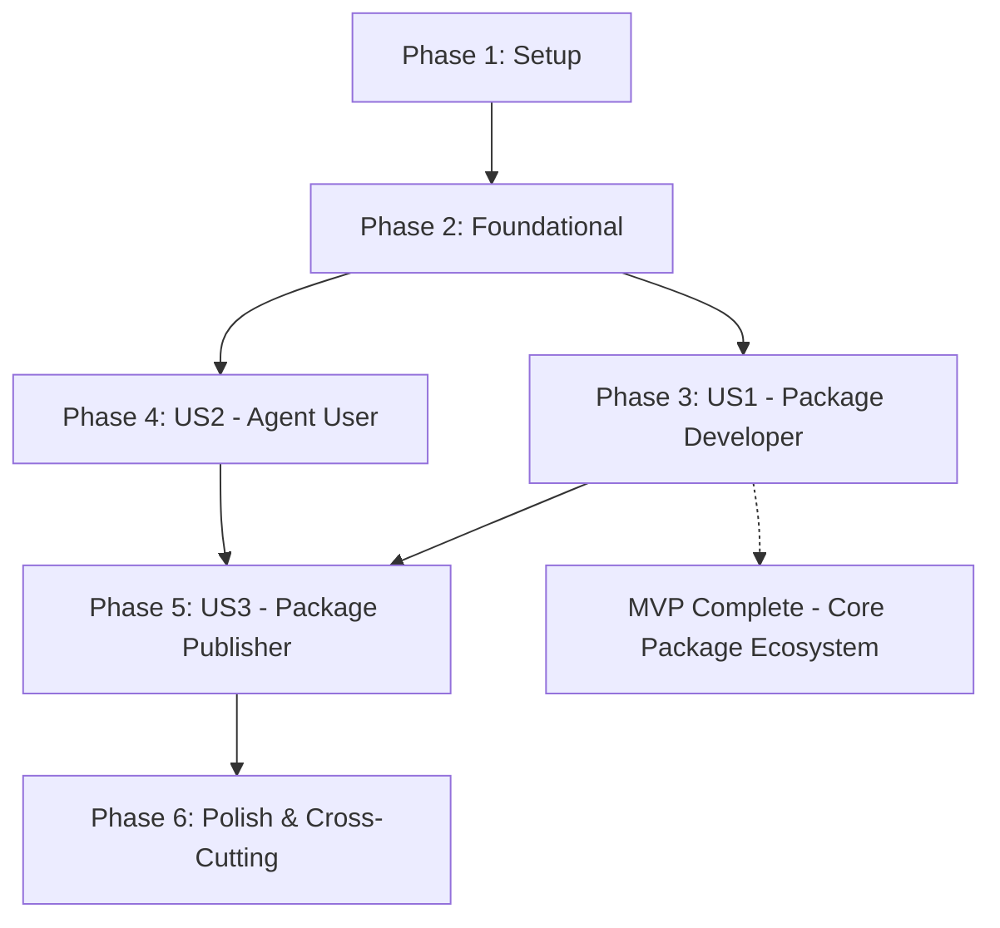

# Implementation Tasks: AIKIT Universal Package System

**Feature**: `1-aikit-generalize` | **Branch**: `1-aikit-generalize` | **Date**: 2024-12-14
**Spec**: [spec.md](../spec.md) | **Plan**: [plan.md](../plan.md)

## Executive Summary

**Total Tasks**: 77 | **Duration**: 17-24 days | **Team**: 1-2 developers

**Task Distribution**:
- **Setup Phase**: 8 tasks
- **Foundational Phase**: 16 tasks
- **User Story 1 (P1)**: 16 tasks - Package Developer Creates Custom Package
- **User Story 2 (P1)**: 12 tasks - Agent User Installs Packages
- **User Story 3 (P2)**: 8 tasks - Package Publisher Shares Work
- **Polish Phase**: 17 tasks

**MVP Scope**: Complete User Story 1 (Package Developer) - enables the core package ecosystem
**Critical Path**: Package data structures → CLI commands → Agent adaptation → GitHub integration

## Dependencies Graph

**Parallel Opportunities**:
- US1 and US2 can execute in parallel after Foundational phase
- Most tasks within each story are parallelizable ([P] markers)
- Cross-agent testing can run in parallel across different agents

---

## Phase 1: Setup (Project Initialization)

**Goal**: Establish project structure and development environment per implementation plan

**Duration**: 1-2 days | **Dependencies**: None

- [X] T001 Create package data structures in src/models/package.rs
- [X] T002 Create registry data structures in src/models/registry.rs
- [X] T003 Create configuration structures in src/models/config.rs
- [X] T004 Set up basic project structure per plan.md specifications
- [ ] T005 Add required dependencies to Cargo.toml (reqwest, zip, serde)
- [ ] T006 Create initial test structure (unit, integration, contract tests)
- [ ] T007 Set up development environment and CI configuration
- [ ] T008 Create initial documentation templates for contracts

---

## Phase 2: Foundational (Core Package Infrastructure)

**Goal**: Implement basic package management infrastructure that all user stories depend on

**Duration**: 3-4 days | **Dependencies**: Phase 1 complete
**Independent Test**: Can parse package.toml files and validate basic package structure

**Tasks**:

### Package Data Model & Validation
- [X] T009 [P] Implement Package metadata structure with TOML parsing in src/core/package.rs
- [X] T010 [P] Create package validation logic for package.toml schema in src/core/package.rs
- [X] T011 [P] Implement artifact mapping system in src/core/package.rs
- [X] T012 [P] Add package dependency resolution (flat model) in src/core/package.rs

### Directory Management System
- [X] T013 [P] Create .aikit/ directory management system in src/core/filesystem.rs
- [X] T014 [P] Implement package registry tracking in src/core/registry.rs
- [X] T015 [P] Add .gitignore automation logic in src/core/git.rs
- [X] T016 [P] Create package lock file management in src/core/lock.rs

### Agent Compatibility Layer
- [X] T017 [P] Extend AgentConfig for package compatibility in src/core/agent.rs
- [X] T018 [P] Implement namespace prefixing system in src/core/agent.rs
- [X] T019 [P] Create agent override handling in src/core/agent.rs
- [X] T020 [P] Add command generation for generic packages in src/core/agent.rs

### Test-First Infrastructure
- [ ] T021 [P] Set up TDD infrastructure with failing test templates in tests/unit/

### Backward Compatibility Validation
- [ ] T022 [P] Verify existing `aikit init claude` works unchanged in tests/integration/backward_compatibility_test.rs
- [ ] T023 [P] Test existing spec-kit template conversion in tests/integration/template_conversion_test.rs
- [ ] T024 [P] Validate all 17 AI agents work with existing templates in tests/integration/agent_compatibility_test.rs

---

## Phase 3: User Story 1 - Package Developer Creates Custom Package (Priority: P1)

**Goal**: Enable developers to create and build custom packages for AI agent extensions

**Duration**: 4-5 days | **Dependencies**: Phase 2 complete
**Independent Test**: Developer can create package.toml, add templates/scripts, build ZIP, and validate package structure

**Acceptance Criteria**:
- `aikit package init my-package` creates proper package structure
- `aikit package build` creates valid distributable ZIP
- Package follows defined schema and validation rules

**Tasks**:

### Package Creation CLI
- [X] T024 [P] [US1] Implement `aikit package init` command in src/cli/commands/package.rs
- [X] T025 [P] [US1] Create package structure generation logic in src/core/package.rs
- [X] T026 [P] [US1] Add package.toml template creation in src/core/package.rs
- [X] T027 [P] [US1] Implement package validation on init in src/cli/commands/package.rs

### Package Building System
- [X] T028 [P] [US1] Implement `aikit package build` command in src/cli/commands/package.rs
- [X] T029 [P] [US1] Create ZIP archive generation in src/core/package.rs
- [X] T030 [P] [US1] Add artifact collection and packaging logic in src/core/package.rs
- [X] T031 [P] [US1] Implement package metadata embedding in ZIP in src/core/package.rs

### Package Validation & Testing
- [X] T032 [P] [US1] Add comprehensive package validation in src/core/package.rs
- [X] T033 [P] [US1] Create unit tests for package creation workflow in tests/unit/package_tests.rs
- [X] T034 [P] [US1] Add integration tests for package building in tests/integration/package_installation_test.rs
- [X] T035 [P] [US1] Implement package structure validation in src/core/package.rs
- [X] T036 [P] [US1] Add error handling for invalid packages in src/cli/commands/package.rs

### Documentation & Examples
- [X] T037 [P] [US1] Create quickstart.md for package developers in specs/1-aikit-generalize/quickstart.md
- [X] T038 [P] [US1] Add package creation examples and templates in docs/
- [X] T039 [US1] Update README.md with package creation instructions

---

## Phase 4: User Story 2 - Agent User Installs Packages (Priority: P1)

**Goal**: Enable AI agent users to discover, install, and manage packages seamlessly

**Duration**: 4-5 days | **Dependencies**: Phase 2 complete
**Independent Test**: User can install package from GitHub URL and use generated commands in their AI agent

**Acceptance Criteria**:
- `aikit install <github-url>` successfully downloads and installs package
- `aikit list` shows installed packages with versions
- `aikit update <package>` updates to latest version
- Agent-specific commands work correctly

**Tasks**:

### Package Installation System
- [X] T040 [P] [US2] Implement `aikit install` command in src/cli/commands/install.rs
- [X] T041 [P] [US2] Create GitHub URL parsing and validation in src/core/git.rs
- [X] T042 [P] [US2] Implement package download from GitHub releases in src/core/git.rs
- [X] T043 [P] [US2] Add package extraction and .aikit/ installation in src/core/filesystem.rs

### Package Management CLI
- [X] T044 [P] [US2] Implement `aikit list` command in src/cli/commands/install.rs
- [X] T045 [P] [US2] Create `aikit remove` command in src/cli/commands/install.rs
- [X] T046 [P] [US2] Implement `aikit update` command in src/cli/commands/install.rs
- [ ] T047 [P] [US2] Add package version checking and comparison in src/core/registry.rs

### Agent Command Generation
- [X] T048 [P] [US2] Create command generation from package definitions in src/core/agent.rs
- [X] T049 [P] [US2] Implement agent-specific command file creation in .{agent}/commands/ directories
- [X] T050 [P] [US2] Add namespace prefix handling for command conflicts in src/core/agent.rs
- [X] T051 [P] [US2] Test command generation across all 17 supported agents in tests/integration/agent_adaptation_test.rs

---

## Phase 5: User Story 3 - Package Publisher Shares Work (Priority: P2)

**Goal**: Enable package creators to publish and share their work with the community

**Duration**: 2-3 days | **Dependencies**: Phase 3 + Phase 4 complete
**Independent Test**: Creator can publish package to GitHub and others can discover/install it

**Acceptance Criteria**:
- `aikit package publish <repo>` uploads package to GitHub releases
- Package appears in search results and can be installed by others
- Publishing workflow integrates with existing GitHub repositories

**Tasks**:

### Package Publishing System
- [X] T052 [P] [US3] Implement `aikit package publish` command in src/cli/commands/package.rs
- [X] T053 [P] [US3] Create GitHub release creation via API in src/core/git.rs
- [X] T054 [P] [US3] Add package upload to GitHub releases in src/core/git.rs
- [X] T055 [P] [US3] Implement version tagging and release notes in src/core/git.rs

### Package Discovery
- [X] T056 [P] [US3] Implement `aikit search` command in src/cli/commands/search.rs
- [X] T057 [P] [US3] Create GitHub repository search functionality in src/core/git.rs
- [X] T058 [P] [US3] Add package metadata extraction from repositories in src/core/git.rs
- [X] T059 [P] [US3] Implement search result formatting and display in src/cli/commands/search.rs

---

## Phase 6: Polish & Cross-Cutting Concerns

**Goal**: Finalize implementation with testing, documentation, and production readiness

**Duration**: 2-3 days | **Dependencies**: All user stories complete

**Tasks**:

### Backward Compatibility
- [ ] T060 [P] Create spec-kit compatibility layer in src/core/compatibility.rs
- [ ] T061 [P] Implement migration detection and warnings in src/cli/mod.rs
- [ ] T062 [P] Test existing AIKIT workflows still work in tests/integration/backward_compatibility_test.rs
- [ ] T063 [P] Update documentation for migration path in docs/migration.md

### Performance & Reliability
- [ ] T064 [P] Implement performance optimizations for package operations
- [ ] T065 [P] Add comprehensive error handling throughout package system
- [X] T066 [P] Create performance tests meeting <30s installation target
- [ ] T067 [P] Implement caching for package downloads and metadata

### Documentation & Testing
- [ ] T068 [P] Complete all contract documentation in specs/1-aikit-generalize/contracts/
- [ ] T069 [P] Create comprehensive integration test suite
- [X] T070 [P] Update main README.md with package management features
- [ ] T071 [P] Finalize user documentation and examples

### Performance & Quality Assurance
- [X] T072 [P] Create performance benchmarks for package installation (<30s target) in tests/performance/
- [ ] T073 [P] Implement command generation performance tests (<1s target) in tests/performance/
- [ ] T074 [P] Add memory usage profiling for package operations in tests/performance/

---

## Implementation Strategy

### MVP First Approach
1. **Complete US1** (Package Developer) → Basic package ecosystem functional
2. **Add US2** (Agent User) → Full user experience
3. **Polish with US3** (Publisher) → Complete ecosystem

### Incremental Delivery
- Each user story delivers independently testable functionality
- Parallel development possible within and across stories
- Continuous integration with comprehensive test coverage

### Risk Mitigation
- Start with local file packages before GitHub integration
- Implement comprehensive validation early
- Maintain backward compatibility throughout
- Extensive cross-agent testing before release

## Quality Gates

### Code Quality
- [ ] All tasks follow checklist format (ID, labels, file paths)
- [ ] Unit test coverage >90% for new functionality
- [ ] Integration tests for all CLI commands
- [ ] Cross-platform compatibility verified

### Feature Completeness
- [ ] All 10 functional requirements implemented
- [ ] All 8 success criteria met
- [ ] Backward compatibility maintained (95% existing functionality)
- [ ] All 17 AI agents working with generic packages

### Performance & Reliability
- [ ] Package installation <30 seconds
- [ ] Command generation <1 second
- [ ] No breaking changes to existing installations
- [ ] Comprehensive error handling and user feedback

**Ready for implementation!** 🚀